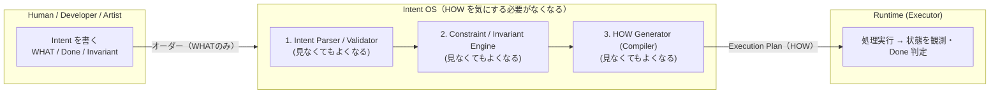
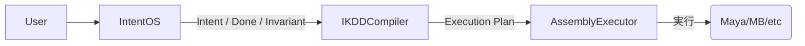

# 📄 IKDD / Intent OS Whitepaper v1.0

*Intent を正しく書くと、HOW（手順）は勝手に決まる*

```
Version: v3.4
Date: 2025-11-08
Author: Shouichi Kanbara (pikovolt)
License: CC BY 4.0
```

---

## Executive Summary（概要）

従来のソフトウェア開発は **HOW（手順）を書くことが前提** だった。

```
どう実行するか（HOW）を人間が考える
```

IKDD / Intent OS は、この前提を覆す。



> **人間は WHAT（意図）を書く。HOW（手順）は OS が決める。**

Intent（WHAT）と Done（状態）のみを宣言すると、
HOW は OS によって決まる（Runtime + Compiler に委譲）。

---

## 1. WHY — なぜ Intent が必要なのか

手順を書けば書くほど、コードは膨れ、知識は属人化する。

| 従来      | 問題                   |
| ------- | -------------------- |
| HOW を書く | 実装依存。属人化する           |
| 修正時     | WHAT が変わらなくても書き換えが必要 |
| テスト     | コードとは別に書く必要          |

IKDD の原則：

> **意図は、実装に従属しない。**

---

## 2. IKDD / Intent OS の構造

Intent OS は **WHAT OS**。
手順（HOW）を生成するのは Runtime。

```
Intent OS (WHAT)
        ↓ Intent（目的と状態を宣言）
IKDD Compiler (HOW Generator)
        ↓ HOW（Execution Plan を生成）
Runtime (Executor)
```

---

## 3. Intent 記述の最小ルール

**例：MotionBuilder / Maya 共通 Null 挿入**

IKDD の Intent 定義は「目的（WHAT）」と「状態（Done / Invariant）」だけを書く。
HOW（手順、API、Null の具体的な作り方）は Intent に書かない。

```yaml
id: InsertNullAsNewParent

Intent: |
  親階層を変更しても、対象モデルの見た目（World Transform）が変わらない状態にする。

Context: |
  - 親として追加するノードは「空ノード」であること（新規生成）
  - 空ノードの種類は環境に応じて Runtime が決定する

Invariant:
  - Before.WorldTransform == After.WorldTransform

Done:
  - 対象モデルが新しい空ノードの直下に存在する
```

> Intent = WHAT
> Context = WHAT を成立させるための前提（Null の要件）
> Invariant / Done = 評価条件（状態ベース）

---

## 4. 「Intent を正しく書くと、HOW は勝手に決まる」

HOW を書かない理由は **状態ベース** で実行するため。

| 従来          | IKDD                    |
| ----------- | ----------------------- |
| 手続き（HOW）を書く | **状態（WHAT）を書く**         |
| コードとテストは別   | **Done がテストにもなる**       |
| 実装によって変更    | **Intent が変わらなければ変更不要** |

---

## 5. IKDD Runtime（v0.3）の動作フロー



---

## 6. Use Case（3DCG パイプライン）

例：MotionBuilder と Maya で動く **共通 Null 挿入ツール**

* DCCごとの差異（APIなど）を Runtime が吸収
* Intent は「目的と状態」しか書かない

---

## 7. 結論

```
手順を書くな。
意図を書け。
HOW は OS に任せろ。
```

Intent を正しく書くと、HOW は勝手に決まる。

---

---

# Appendix A — Full Intent Definition

> 本付録は、Intent OS のルールに従って実際に生成された成果物（Intent 定義の例）を示すものであり、仕様や実装手順を説明するものではありません。

**/whitepaper/v3.4/source/ExecutePipeline_full.yaml**

```yaml
id: ExecutePipeline
version: 0.3-complete

Intent: |
  pipeline（工程 sequence）を実行し、定義された工程がすべて完了した状態にする。
  実行順序は sequence の定義に従うものとする。

Context: |
  - IKDD Runtime / Sequence Dispatcher
  - sequence は YAML で外部化される
  - process は Python module として実装される（例: src/process/*.py）
  - Intent は WHAT / Runtime は HOW（OS層）が担当する

PreCondition: |
  - entry sequence（YAML）が存在している
  - sequence_root と process_root が指定されている
  - mapping.sequence / mapping.process が解決可能である

HOW:
  must:
    # --- YAMLとprocessの関係 ---
    - sequence は YAML（外部ファイル）として定義されること
    - sequence の項目は process または sequence を含むことができ、再帰構造を許容する
    - mapping.sequence と mapping.process が存在すること

    # --- flatten / path / depth ---
    - Runtime は実行前に sequence を flatten する
    - flatten の際、各 process に以下の情報を付与する:
        * depth: sequence の階層深さ（0 が root）
        * path: "親/子/孫" の形式で表す階層パス（例: "main/SubTask"）
        * source: どの YAML から来たか（例: "main.yaml"）
    - depth > depth_max ならエラーとし、実行を開始しない

    # --- preview（dry run）---
    - preview モードでは flatten 結果を表示し、実行は行わない
    - preview は階層表示（元の nested 構造）が可能であること
    - preview は flatten（execution plan）を表示すること

    # --- verbose（本番実行）---
    - verbose モードでは flatten の順序で process を実行する
    - 実行ログでは path を "(main/SubTask)" の形式で表示すること
    - 表示に depth のインデントは使用せず、path のみで階層を識別できるようにする

    # --- fail / fail_post ---
    - process が例外を出した場合、fail_post が定義されていれば必ず実行する
    - fail_post → 次工程への propagate は任意（Runtimeに委譲）

  forbidden:
    - flatten 後の順番を変更して実行すること
    - sequence を実行中に暗黙的に上書きすること
    - intent 側で HOW（runtime 実装）を推測・記述すること

  keep:
    - sequence の実行順序を保持すること
    - 明示した shared state は工程間で引き継ぐこと
    - temp state は process 毎に破棄されること

Done: |
  - flatten 結果の順序通りにすべての process が実行された
  - verbose 実行時、各 process の path が表示された（例: "> Validate (main/SubTask)"）
  - preview モードでは、実行計画（階層 + flatten）が出力され、process が実行されていない
  - depth_max を超える階層構造は実行前にエラーとなる

Meta: |
  rules:
    - Intent は WHAT を表し、HOW（実装の詳細）は Runtime が管理する
    - 推測禁止：Intent 層に実装や API の情報を書かない
    - Runtime 層は Intent の HOW に従う OS として振る舞う
```

---
© 2025 Shouichi Kanbara (pikovolt). Licensed under CC BY 4.0.
