# 📄 IKDD / Intent OS Whitepaper v1.0

*When you write Intent correctly, HOW (procedure) is automatically determined*

```
Version: v1.0
Date: 2025-11-08
Author: Shouichi Kanbara (pikovolt)
License: CC BY 4.0
```

---

## Executive Summary

Traditional software development **presupposed writing HOW (procedures)**.

```
Humans think about how to execute (HOW)
```

IKDD / Intent OS overturns this assumption.

```mermaid
flowchart LR
    subgraph HUMAN["Human / Developer / Artist"]
        A["Write Intent\nWHAT / Done / Invariant"]
    end

    A -->|"Order (WHAT only)"| OS

    subgraph OS["Intent OS (No need to worry about HOW)"]
        direction TB
        P["1. Intent Parser / Validator\n(No need to see)"]
        C["2. Constraint / Invariant Engine\n(No need to see)"]
        G["3. HOW Generator (Compiler)\n(No need to see)"]
        P --> C --> G
    end

    G -->|"Execution Plan (HOW)"| R

    subgraph RT["Runtime (Executor)"]
        R["Execute processing → Observe state, judge Done"]
    end
```



> **Humans write WHAT (intent). OS determines HOW (procedure).**

When you declare only Intent (WHAT) and Done (state),
HOW is determined by the OS (delegated to Runtime + Compiler).

---

## 1. WHY — Why Intent Is Necessary

The more procedures you write, the more code bloats and knowledge becomes siloed.

| Traditional      | Problem                   |
| ------- | -------------------- |
| Write HOW | Implementation-dependent. Becomes siloed           |
| When modifying     | Rewriting necessary even if WHAT doesn't change |
| Testing     | Must be written separately from code          |

IKDD principle:

> **Intent does not subordinate to implementation.**

---

## 2. IKDD / Intent OS Structure

Intent OS is **WHAT OS**.
Runtime generates procedures (HOW).

```
Intent OS (WHAT)
        ↓ Intent (Declare purpose and state)
IKDD Compiler (HOW Generator)
        ↓ HOW (Generate Execution Plan)
Runtime (Executor)
```

---

## 3. Minimum Rules for Intent Description

**Example: MotionBuilder / Maya Common Null Insertion**

IKDD Intent definitions write only "purpose (WHAT)" and "state (Done / Invariant)".
Don't write HOW (procedures, API, concrete way to create Null) in Intent.

```yaml
id: InsertNullAsNewParent

Intent: |
  Make it so target model's appearance (World Transform) doesn't change even if parent hierarchy changes.

Context: |
  - Node to add as parent must be "empty node" (newly generated)
  - Type of empty node is determined by Runtime according to environment

Invariant:
  - Before.WorldTransform == After.WorldTransform

Done:
  - Target model exists directly under new empty node
```

> Intent = WHAT
> Context = Prerequisites for WHAT to be satisfied (Null requirements)
> Invariant / Done = Evaluation conditions (state-based)

---

## 4. "When You Write Intent Correctly, HOW Is Automatically Determined"

The reason for not writing HOW is to execute on a **state basis**.

| Traditional          | IKDD                    |
| ----------- | ----------------------- |
| Write procedures (HOW) | **Write state (WHAT)**         |
| Code and tests are separate   | **Done also serves as test**       |
| Changes by implementation    | **No change needed if Intent doesn't change** |

---

## 5. IKDD Runtime (v0.3) Operation Flow


---

## 6. Use Case (3DCG Pipeline)

Example: **Common Null insertion tool** that works in MotionBuilder and Maya

* Runtime absorbs differences between DCCs (API, etc.)
* Intent only writes "purpose and state"

---

## 7. Conclusion

```
Don't write procedures.
Write intent.
Leave HOW to the OS.
```

When you write Intent correctly, HOW is automatically determined.

---

---

# Appendix A — Full Intent Definition

> This appendix shows a deliverable (example of Intent definition) actually generated following Intent OS rules and does not explain specifications or implementation procedures.

**/whitepaper/v3.4/source/ExecutePipeline_full.yaml**

```yaml
id: ExecutePipeline
version: 0.3-complete

Intent: |
  Execute pipeline (process sequence) and bring all defined processes to completion.
  Execution order shall follow sequence definition.

Context: |
  - IKDD Runtime / Sequence Dispatcher
  - sequence is externalized in YAML
  - process is implemented as Python module (e.g. src/process/*.py)
  - Intent is WHAT / Runtime is HOW (OS layer) responsible

PreCondition: |
  - entry sequence (YAML) exists
  - sequence_root and process_root are specified
  - mapping.sequence / mapping.process are resolvable

HOW:
  must:
    # --- Relationship between YAML and process ---
    - sequence must be defined as YAML (external file)
    - sequence items can include process or sequence, allowing recursive structure
    - mapping.sequence and mapping.process must exist

    # --- flatten / path / depth ---
    - Runtime flattens sequence before execution
    - When flattening, add following information to each process:
        * depth: sequence hierarchy depth (0 is root)
        * path: Hierarchical path expressed as "parent/child/grandchild" (e.g. "main/SubTask")
        * source: Which YAML it came from (e.g. "main.yaml")
    - If depth > depth_max, error and don't start execution

    # --- preview (dry run)---
    - preview mode displays flatten result and doesn't execute
    - preview must be able to display hierarchy (original nested structure)
    - preview must display flatten (execution plan)

    # --- verbose (production execution)---
    - verbose mode executes process in flatten order
    - Execution log must display path in format "(main/SubTask)"
    - Don't use depth indentation for display, enable hierarchy identification by path only

    # --- fail / fail_post ---
    - If process throws exception, must execute fail_post if defined
    - fail_post → propagate to next process is optional (delegate to Runtime)

  forbidden:
    - Execute by changing order after flatten
    - Implicitly overwrite sequence during execution
    - Infer or describe HOW (runtime implementation) on intent side

  keep:
    - Preserve sequence execution order
    - Explicitly stated shared state is inherited between processes
    - temp state is discarded per process

Done: |
  - All processes executed in flatten result order
  - During verbose execution, path of each process was displayed (e.g. "> Validate (main/SubTask)")
  - In preview mode, execution plan (hierarchy + flatten) is output and processes are not executed
  - Hierarchical structure exceeding depth_max errors before execution

Meta: |
  rules:
    - Intent represents WHAT, Runtime manages HOW (implementation details)
    - No guessing: Don't write implementation or API information in Intent layer
    - Runtime layer behaves as OS following Intent's HOW
```

---
© 2025 Shouichi Kanbara (pikovolt). Licensed under CC BY 4.0.
