# 📄 IKDD / Intent OS Whitepaper v1.0

*Intent を正しく書くと、HOW(手順)は勝手に決まる*

```
Version: v1.0
Date: 2025-11-08
Author: Shouichi Kanbara (pikovolt)
License: CC BY 4.0
```

---

## Executive Summary(概要)

従来のソフトウェア開発は **HOW(手順)を書くことが前提** だった。

```
どう実行するか(HOW)を人間が考える
```

IKDD / Intent OS は、この前提を覆す。

```mermaid
flowchart LR
    subgraph HUMAN["Human / Developer / Artist"]
        A["Intent を書く\nWHAT / Done / Invariant"]
    end

    A -->|"オーダー(WHATのみ)"| OS

    subgraph OS["Intent OS(HOW を気にする必要がなくなる)"]
        direction TB
        P["1. Intent Parser / Validator\n(見なくてもよくなる)"]
        C["2. Constraint / Invariant Engine\n(見なくてもよくなる)"]
        G["3. HOW Generator (Compiler)\n(見なくてもよくなる)"]
        P --> C --> G
    end

    G -->|"Execution Plan(HOW)"| R

    subgraph RT["Runtime (Executor)"]
        R["処理実行 → 状態を観測・Done 判定"]
    end
```



> **人間は WHAT(意図)を書く。HOW(手順)は OS が決める。**

Intent(WHAT)と Done(状態)のみを宣言すると、
HOW は OS によって決まる(Runtime + Compiler に委譲)。

---

## 1. WHY — なぜ Intent が必要なのか

手順を書けば書くほど、コードは膨れ、知識は属人化する。

| 従来      | 問題                   |
| ------- | -------------------- |
| HOW を書く | 実装依存。属人化する           |
| 修正時     | WHAT が変わらなくても書き換えが必要 |
| テスト     | コードとは別に書く必要          |

IKDD の原則:

> **意図は、実装に従属しない。**

---

## 2. IKDD / Intent OS の構造

Intent OS は **WHAT OS**。
手順(HOW)を生成するのは Runtime。

```
Intent OS (WHAT)
        ↓ Intent(目的と状態を宣言)
IKDD Compiler (HOW Generator)
        ↓ HOW(Execution Plan を生成)
Runtime (Executor)
```

---

## 3. Intent 記述の最小ルール

**例:MotionBuilder / Maya 共通 Null 挿入**

IKDD の Intent 定義は「目的(WHAT)」と「状態(Done / Invariant)」だけを書く。
HOW(手順、API、Null の具体的な作り方)は Intent に書かない。

```yaml
id: InsertNullAsNewParent

Intent: |
  親階層を変更しても、対象モデルの見た目(World Transform)が変わらない状態にする。

Context: |
  - 親として追加するノードは「空ノード」であること(新規生成)
  - 空ノードの種類は環境に応じて Runtime が決定する

Invariant:
  - Before.WorldTransform == After.WorldTransform

Done:
  - 対象モデルが新しい空ノードの直下に存在する
```

> Intent = WHAT
> Context = WHAT を成立させるための前提(Null の要件)
> Invariant / Done = 評価条件(状態ベース)

---

## 4. 「Intent を正しく書くと、HOW は勝手に決まる」

HOW を書かない理由は **状態ベース** で実行するため。

| 従来          | IKDD                    |
| ----------- | ----------------------- |
| 手続き(HOW)を書く | **状態(WHAT)を書く**         |
| コードとテストは別   | **Done がテストにもなる**       |
| 実装によって変更    | **Intent が変わらなければ変更不要** |

---

## 5. IKDD Runtime(v0.3)の動作フロー


---

## 6. Use Case(3DCG パイプライン)

例:MotionBuilder と Maya で動く **共通 Null 挿入ツール**

* DCCごとの差異(APIなど)を Runtime が吸収
* Intent は「目的と状態」しか書かない

---

## 7. 結論

```
手順を書くな。
意図を書け。
HOW は OS に任せろ。
```

Intent を正しく書くと、HOW は勝手に決まる。

---

---

# Appendix A — Full Intent Definition

> 本付録は、Intent OS のルールに従って実際に生成された成果物(Intent 定義の例)を示すものであり、仕様や実装手順を説明するものではありません。

**/whitepaper/v3.4/source/ExecutePipeline_full.yaml**

```yaml
id: ExecutePipeline
version: 0.3-complete

Intent: |
  pipeline(工程 sequence)を実行し、定義された工程がすべて完了した状態にする。
  実行順序は sequence の定義に従うものとする。

Context: |
  - IKDD Runtime / Sequence Dispatcher
  - sequence は YAML で外部化される
  - process は Python module として実装される(例: src/process/*.py)
  - Intent は WHAT / Runtime は HOW(OS層)が担当する

PreCondition: |
  - entry sequence(YAML)が存在している
  - sequence_root と process_root が指定されている
  - mapping.sequence / mapping.process が解決可能である

HOW:
  must:
    # --- YAMLとprocessの関係 ---
    - sequence は YAML(外部ファイル)として定義されること
    - sequence の項目は process または sequence を含むことができ、再帰構造を許容する
    - mapping.sequence と mapping.process が存在すること

    # --- flatten / path / depth ---
    - Runtime は実行前に sequence を flatten する
    - flatten の際、各 process に以下の情報を付与する:
        * depth: sequence の階層深さ(0 が root)
        * path: "親/子/孫" の形式で表す階層パス(例: "main/SubTask")
        * source: どの YAML から来たか(例: "main.yaml")
    - depth > depth_max ならエラーとし、実行を開始しない

    # --- preview(dry run)---
    - preview モードでは flatten 結果を表示し、実行は行わない
    - preview は階層表示(元の nested 構造)が可能であること
    - preview は flatten(execution plan)を表示すること

    # --- verbose(本番実行)---
    - verbose モードでは flatten の順序で process を実行する
    - 実行ログでは path を "(main/SubTask)" の形式で表示すること
    - 表示に depth のインデントは使用せず、path のみで階層を識別できるようにする

    # --- fail / fail_post ---
    - process が例外を出した場合、fail_post が定義されていれば必ず実行する
    - fail_post → 次工程への propagate は任意(Runtimeに委譲)

  forbidden:
    - flatten 後の順番を変更して実行すること
    - sequence を実行中に暗黙的に上書きすること
    - intent 側で HOW(runtime 実装)を推測・記述すること

  keep:
    - sequence の実行順序を保持すること
    - 明示した shared state は工程間で引き継ぐこと
    - temp state は process 毎に破棄されること

Done: |
  - flatten 結果の順序通りにすべての process が実行された
  - verbose 実行時、各 process の path が表示された(例: "> Validate (main/SubTask)")
  - preview モードでは、実行計画(階層 + flatten)が出力され、process が実行されていない
  - depth_max を超える階層構造は実行前にエラーとなる

Meta: |
  rules:
    - Intent は WHAT を表し、HOW(実装の詳細)は Runtime が管理する
    - 推測禁止:Intent 層に実装や API の情報を書かない
    - Runtime 層は Intent の HOW に従う OS として振る舞う
```

---
© 2025 Shouichi Kanbara (pikovolt). Licensed under CC BY 4.0.
