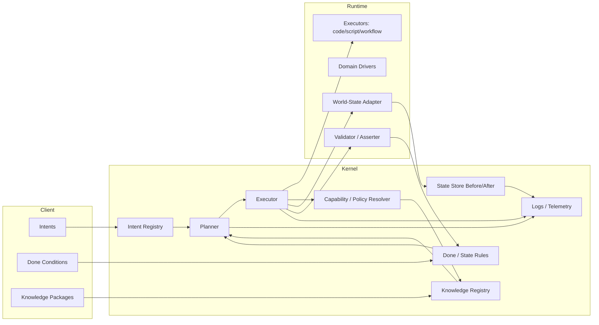
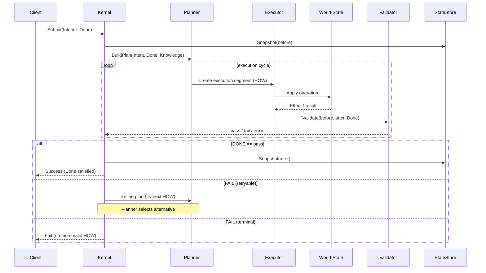
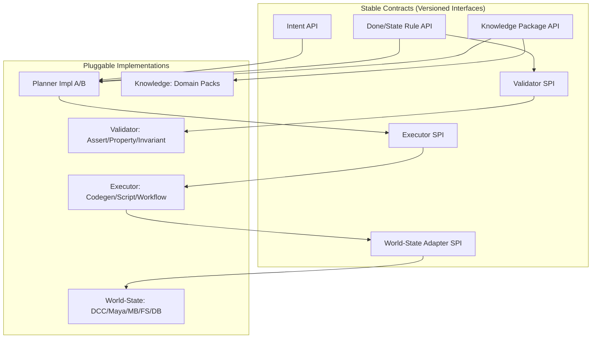

# Intent OS — Architecture

## 1) 全体ブロック図（レイヤ / データフロー）

---

## 2) 実行シーケンス図（Intent→DONE まで）

---

## 3) コンポーネント依存関係（プラガブル境界）

---

## 4) 最小の役割定義（要約）

| コンポーネント               | 役割（要点のみ）                            |
| --------------------- | ----------------------------------- |
| Intent Registry       | Intent の永続・版管理・参照（主語の保存）            |
| Done/State Rules      | 成功条件・評価式・不変条件の定義                    |
| Knowledge Registry    | HOW 候補（ドメイン手段）の公開・選択可能性             |
| Planner               | Intent/Done/Knowledge から実行計画を合成・再計画 |
| Executor Orchestrator | 実行単位を選択・並列/逐次制御・リトライ/フォールバック        |
| World-State Adapters  | 外界 I/O（DCC/FS/DB/HTTP…）を状態操作として抽象化  |
| Validators/Asserters  | Before/After と Done を用いた合否判定        |
| State Store           | Before/After スナップショット・差分・リプレイ       |
| Policy/Capability     | 実行可否・優先度・信頼度・コストの制御                 |
| Telemetry/Logs        | 追跡・デバッグ・再現性のための記録                   |

---

## 5) 参考：Interface名の最小スケッチ

> 仕様化を急がず、**ブレない最小名** のみ。

* `IntentAPI.put/get/list/versions`
* `DoneAPI.register/evaluate(query)`
* `KnowledgeAPI.publish/query(capability,tags)`
* `Planner.plan(intentRef, ctx)`
* `Executor.run(planSegment) -> effects`
* `World.read/patch(query|ops)`
* `Validator.check(doneSpec, before, after)`
* `StateStore.snapshot(tag)/diff(a,b)/replay(tag)`

---

⚠️ 本ドキュメントは、Intent OS の初期段階の概念設計です。
構成・実装は今後変更される可能性があります。
本仕様は「現時点の理解（current understanding）」を共有するためのものです。
