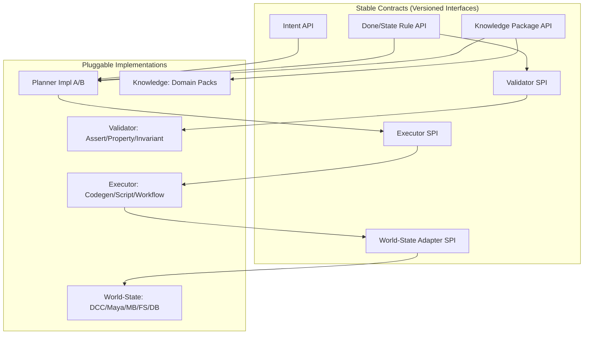

# Intent OS — Architecture

## 1) 全体ブロック図（レイヤ / データフロー）

```mermaid
flowchart LR
    subgraph Client["Client / Tools"]
        I[Intents]
        DSpec[Done Conditions]
        Ksnip[External Knowledge Packages]
    end

    subgraph Kernel["Intent OS Kernel"]
        DIR[Intent Registry]
        DNR[Done/State Rules Registry]
        KREG[Knowledge Registry]
        PLAN[Planner]
        EXEC[Executor Orchestrator]
        OBS[Telemetry / Logs]
        STORE[State Store (Before/After)]
        POL[Policy & Capability Resolver]
    end

    subgraph Runtime["Runtime Adapters"]
        WS[World-State Adapters]
        DRV[Domain Drivers (DCC/DB/FS/HTTP/...)]
        EXE[Executors (Codegen/Script/Workflow)]
        VAL[Validators & Asserters]
    end

    I -->|register/submit| DIR
    DSpec -->|register| DNR
    Ksnip -->|publish| KREG

    DIR --> PLAN
    DNR --> PLAN
    KREG --> PLAN
    PLAN -->|execution plan| EXEC

    EXEC -->|select/compose HOW| EXE
    EXEC -->|capability check| POL
    POL --> KREG

    WS <-->|read/write| STORE
    EXEC -->|mutate/query| WS
    EXE -->|use| DRV

    EXEC --> VAL
    VAL -->|DONE?| DNR

    STORE --> OBS
    PLAN --> OBS
    EXEC --> OBS
```

---

## 2) 実行シーケンス図（Intent→DONE まで）

```mermaid
sequenceDiagram
    participant Client
    participant Kernel
    participant Planner
    participant Executor
    participant World as World-State Adapter
    participant Validator as Validator/Asserter
    participant Store as State Store

    Client->>Kernel: Submit(Intent, Done)
    Kernel->>Store: Snapshot(Before)
    Kernel->>Planner: BuildPlan(Intent, Done, Knowledge)

    loop until DONE
        Planner-->>Executor: ExecutionPlan(HOW candidates)
        Executor->>World: Apply(Operation)
        World-->>Executor: Effects
        Executor->>Validator: Evaluate(Done, Store.Before, World.Current)
        Validator-->>Kernel: Result(pass/fail + deltas)

        alt pass == true
            Kernel->>Store: Snapshot(After)
            Kernel-->>Client: Success(Proof: Before/After, Logs)
            break
        else fail == true & recoverable
            Kernel->>Planner: RefinePlan(ctx, failures, capabilities)
            note right of Planner: swap/compose HOW<br/>add knowledge / downgrade
        else terminal failure
            Kernel-->>Client: Fail(Trace, Artifacts)
            break
        end
    end
```

---

## 3) コンポーネント依存関係（プラガブル境界）



---

## 4) 最小の役割定義（要約）

| コンポーネント               | 役割（要点のみ）                            |
| --------------------- | ----------------------------------- |
| Intent Registry       | Intent の永続・版管理・参照（主語の保存）            |
| Done/State Rules      | 成功条件・評価式・不変条件の定義                    |
| Knowledge Registry    | HOW 候補（ドメイン手段）の公開・選択可能性             |
| Planner               | Intent/Done/Knowledge から実行計画を合成・再計画 |
| Executor Orchestrator | 実行単位を選択・並列/逐次制御・リトライ/フォールバック        |
| World-State Adapters  | 外界 I/O（DCC/FS/DB/HTTP…）を状態操作として抽象化  |
| Validators/Asserters  | Before/After と Done を用いた合否判定        |
| State Store           | Before/After スナップショット・差分・リプレイ       |
| Policy/Capability     | 実行可否・優先度・信頼度・コストの制御                 |
| Telemetry/Logs        | 追跡・デバッグ・再現性のための記録                   |

---

## 5) 参考：Interface名の最小スケッチ

> 仕様化を急がず、**ブレない最小名** のみ。

* `IntentAPI.put/get/list/versions`
* `DoneAPI.register/evaluate(query)`
* `KnowledgeAPI.publish/query(capability,tags)`
* `Planner.plan(intentRef, ctx)`
* `Executor.run(planSegment) -> effects`
* `World.read/patch(query|ops)`
* `Validator.check(doneSpec, before, after)`
* `StateStore.snapshot(tag)/diff(a,b)/replay(tag)`

---

⚠️ 本ドキュメントは、Intent OS の初期段階の概念設計です。
構成・実装は今後変更される可能性があります。
本仕様は「現時点の理解（current understanding）」を共有するためのものです。
